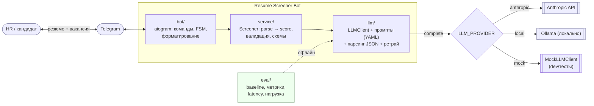
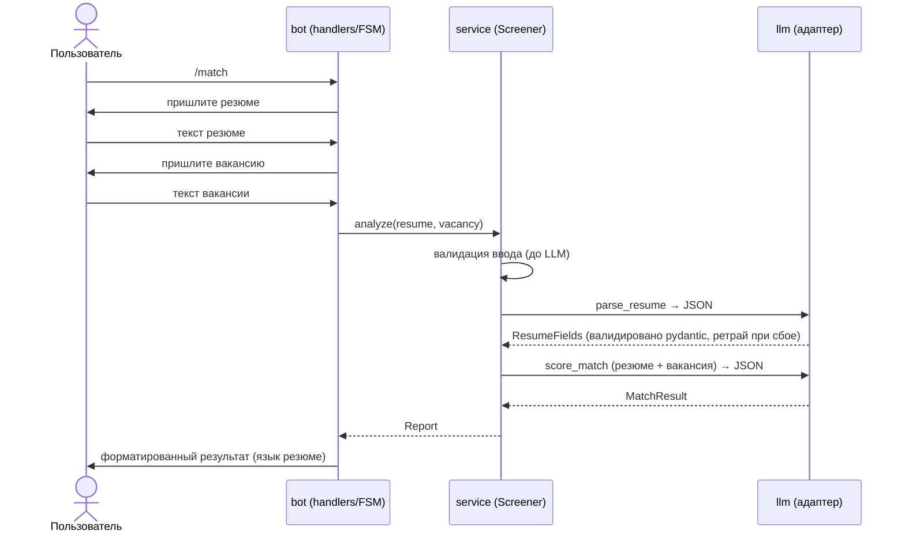

# Архитектура — Resume Screener Bot

Документ для Блока 3 (архитектура): слои и их ответственность, поток данных,
заменяемость модели, узкое место, масштабирование и риски.

## Слои и ответственность

Проект разделён на слои с чёткой ответственностью — это исключает «монолитный скрипт»
и обеспечивает заменяемость модели. Зависимости направлены вниз: `bot → service → llm`;
`config` — общий нижний уровень; `eval` использует те же `service`/`llm` офлайн.

| Слой | Пакет | Ответственность | Технологии |
|---|---|---|---|
| Интерфейс | `bot/` | приём сообщений, FSM-диалог, валидация, форматирование ответа (RU/EN) | aiogram |
| Бизнес-логика | `service/` | оркестрация parse→score, pydantic-схемы, валидация ввода, доменные ошибки | Python, pydantic |
| Адаптер модели | `llm/` | абстракция `LLMClient`, провайдеры, парсинг/валидация JSON + ретрай, промпты | anthropic / openai (Ollama) SDK |
| Конфигурация | `config/` | чтение настроек из окружения | pydantic-settings |
| Оценка | `eval/` | baseline, метрики, latency/стоимость, нагрузочный тест | scikit-learn, matplotlib |

Доменные ошибки разнесены по слоям: `LLMError`/`ParseError` определены в `llm/` (нижний
слой владеет своими ошибками), `ScreenerError`/`InputValidationError` — в `service/`.

## Контейнерная диаграмма (C4-Container, уровень контейнеров)

## Поток данных (сценарий /match)

Ошибки на любом шаге (`InputValidationError`, `ParseError`, `LLMError`) ловятся ботом и
превращаются в понятное сообщение — бот не падает.

## Заменяемость модели

Провайдер скрыт за абстрактным `LLMClient` (метод `complete`). Фабрика `llm/factory.py`
выбирает реализацию по `LLM_PROVIDER` (`anthropic` | `local` | `mock`), модель — по
`LLM_MODEL`. Это даёт:

- разработку и тесты **без ключей** (`mock`);
- страховку от исчерпания кредитов Console (`local` → Ollama);
- смену модели/провайдера одной переменной окружения, без правок логики.

Промпты вынесены в `llm/prompts/*.yaml` (версионируются) — формулировки меняются без кода.

## Узкое место и масштабирование

- **Узкое место:** сетевые вызовы LLM (latency ~секунды) и rate limits провайдера, а не CPU.
  Интерфейс асинхронный (aiogram + async `LLMClient`), поэтому один процесс обрабатывает
  много диалогов конкурентно, не блокируя event loop.
- **Как масштабировать:**
  - горизонтально — несколько реплик бота (stateless; FSM-хранилище вынести в Redis);
  - очередь задач (например, при пакетном ранжировании резюме) с воркерами;
  - кэширование/`prompt caching` системного промпта (уже включено в anthropic-клиенте) —
    снижает стоимость и latency повторов;
  - батч-режим Anthropic для офлайн-прогона метрик на большом датасете.

## Риски

- **Исчерпание кредитов Console** → митигация: `local`-провайдер (Ollama) в том же интерфейсе.
- **Галлюцинации LLM** (выдуманные навыки) → строгий промпт «только на основе текста»,
  валидация JSON по pydantic-схемам, опциональные поля → `null` вместо выдумки, один ретрай.
- **Предвзятость модели** при оценке кандидатов → этическое ограничение: бот помогает и
  структурирует первичный этап, финальное решение принимает человек.
