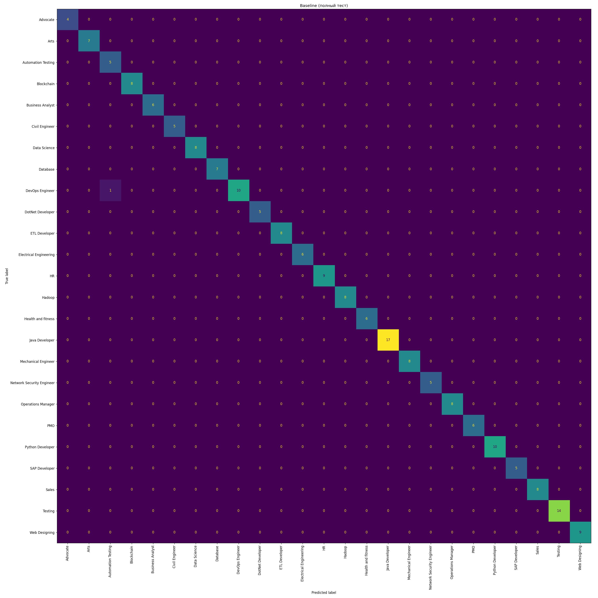
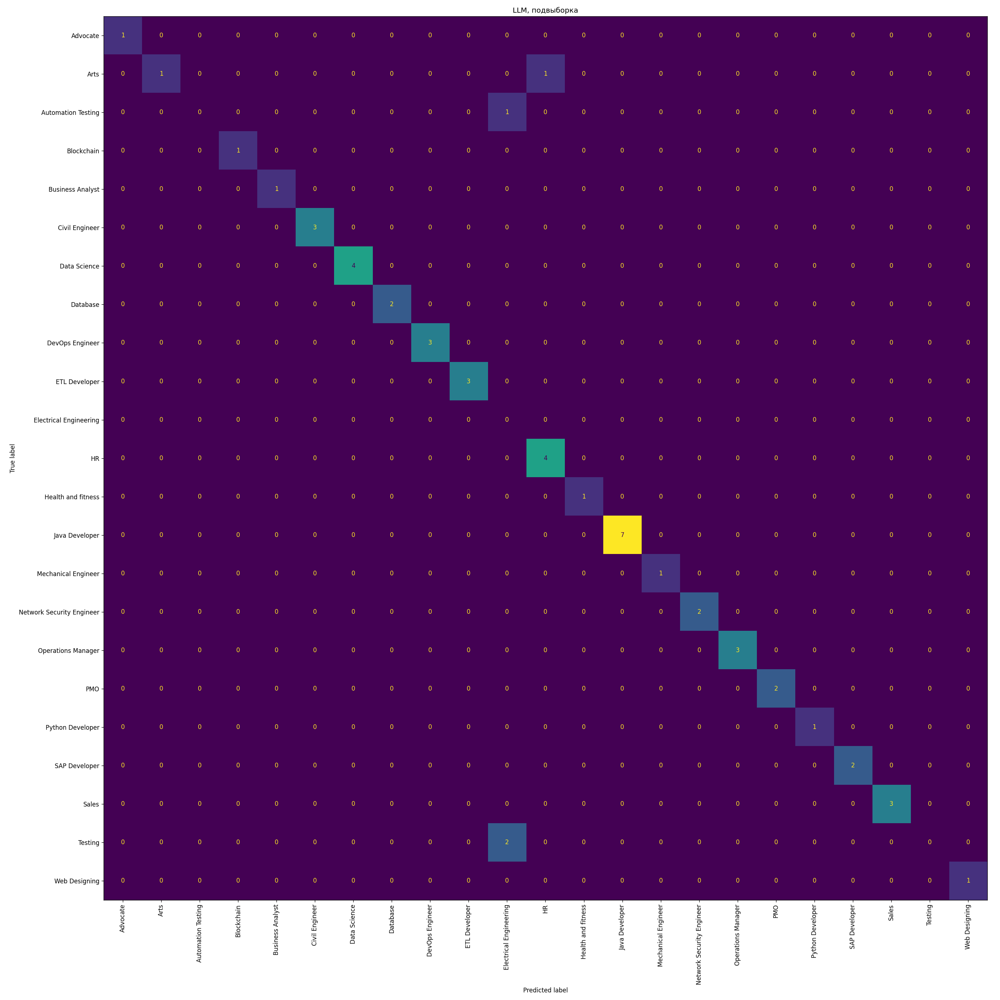

# Результаты: метрики, производительность, стоимость

Прогон выполнен на локальной модели **llama3.1 (8B)** через Ollama (`temperature=0`,
structured output). На хостинговой модели (Anthropic Haiku/Sonnet) цифры будут другими:
выше качество, ниже latency, выше пропускная способность. Команды для воспроизведения —
в [README](../README.md).

## Датасет

Kaggle Resume Dataset (`UpdatedResumeDataSet.csv`): **962 резюме, 25 категорий** профессий.
Стратифицированное разбиение train/test = 80/20 → **769 / 193**, seed=42.

## Качество классификации категории резюме

Метрика — **accuracy** и **macro-F1** (macro, т.к. классы несбалансированы). Сравниваем
простой baseline (TF-IDF + логистическая регрессия) и LLM. LLM гоняли на подвыборке n=50
(ради времени и токенов); baseline посчитан и на полном тесте, и на той же подвыборке —
чтобы сравнение было честным (apples-to-apples).

| Модель | Выборка | Accuracy | macro-F1 |
|---|---|---|---|
| Baseline (TF-IDF + LogReg) | тест, n=193 | **0.995** | **0.994** |
| Baseline | подвыборка n=50 | 1.000 | 1.000 |
| LLM (llama3.1) | подвыборка n=50 | 0.920 | 0.889 |

Confusion matrix:

- Baseline (полный тест): 
- LLM (подвыборка): 

### Интерпретация

- На этой задаче **baseline точнее LLM** (0.995 vs 0.92) и при этом мгновенный и
  бесплатный. Причина: у резюме каждой категории очень характерная лексика (названия
  технологий и инструментов), которую TF-IDF ловит почти идеально. Это прямой ответ на
  вопрос «можно ли без LLM»: для **закрытой классификации по 25 категориям — да**,
  baseline достаточно.
- Поэтому LLM в проекте используется **не для классификации**, а для открытых задач, где
  правила и TF-IDF бессильны: структурный разбор произвольного резюме (навыки, опыт,
  грейд) и **оценка соответствия конкретной вакансии с объяснением**. Там нет
  фиксированного словаря классов и важно «понимание смысла» (например,
  «контейнеризация» ≈ требование «Docker»).
- **Trade-off:** baseline — точность/скорость/нулевая стоимость, но только классификация
  по фиксированному списку; LLM — гибкость и открытые ответы ценой latency и стоимости.
  Выбор LLM для основного сценария обоснован, а на метриках честно показано, где он
  проигрывает простому методу.

## Latency и стоимость (сценарий /match = разбор + оценка, 2 вызова модели)

5 последовательных запросов, llama3.1 локально:

| Метрика | Значение |
|---|---|
| latency mean | 31.2 c |
| latency p50 | 30.2 c |
| latency p95 | 37.2 c |
| токенов на запрос | ≈1022 вход / ≈300 выход |
| стоимость (оценка) | ≈ $0.0025 / запрос |

На локальной модели стоимость фактически **нулевая** (свой компьютер). Значение
$0.0025 — это **оценка**, если бы тот же объём токенов считался на Anthropic Haiku
(по иллюстративному прайсу $1 / $5 за 1М вход/выход токенов; актуальные цены — в Console).
Это и закрывает пункт «оценка стоимости (если API)».

## Поведение на длинном входе

Резюме ~**15 000 символов** (≈4095 входных токенов; лимит `MAX_INPUT_CHARS=15000`):
один разбор занял **55 c** на локальной 8B-модели — втрое дольше обычного запроса.
Вывод: длинные входы дороги по времени; лимит длины ввода оправдан, а штатный таймаут
30 c на таких входах нужно поднимать (или резать вход).

## Нагрузочный тест

5 одновременных запросов /match (= 10 параллельных вызовов модели), таймаут 30 c:

| Метрика | Значение |
|---|---|
| ошибок | 3 из 5 (60%) |
| latency p50 / p95 | 91 c / 102 c |
| wall / throughput | 105 c / ≈0 запр/с |

### Узкое место и масштабирование

Узкое место — **инференс модели**: один локальный экземпляр Ollama сериализует запросы,
и при конкуренции часть превышает таймаут 30 c → ошибки. Для одной локальной 8B-модели
это ожидаемо. Как масштабировать (подробнее в [architecture.md](architecture.md)):
несколько реплик/воркеров, хостинговый API с высокой пропускной способностью, очередь
задач, увеличенный таймаут, prompt caching системного промпта. При этом **бот не падает** —
ошибки модели ловятся и превращаются в понятное сообщение пользователю.

## Оговорки

- Все цифры — локальная llama3.1 (8B), `temperature=0`; на Haiku/Sonnet качество и latency
  будут лучше.
- LLM-метрики и нагрузка измерены на подвыборке (n=50 / 5 запросов) ради времени; baseline
  посчитан на полном тесте.
- Стоимость — оценка по токенам, а не фактический счёт (локальная модель бесплатна).
